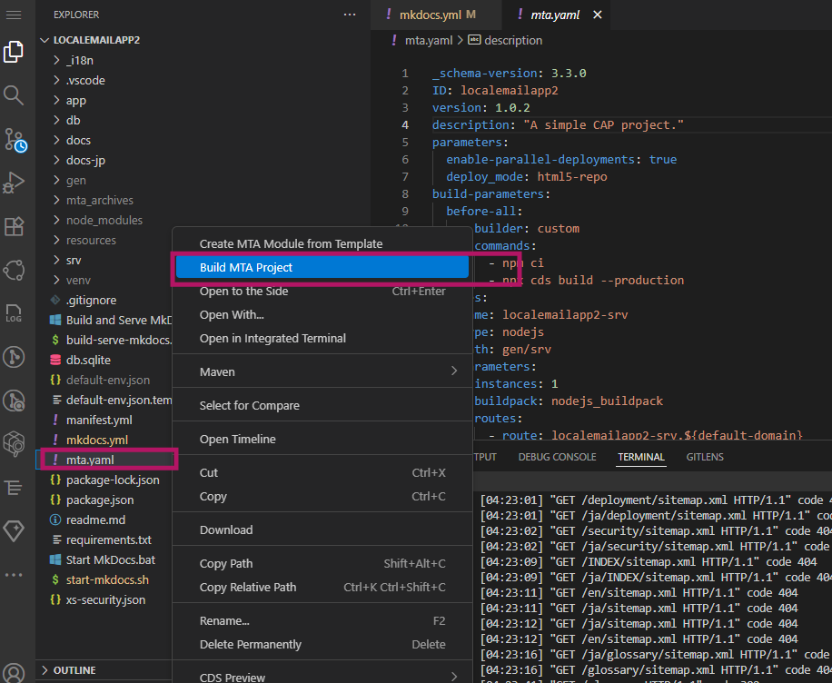
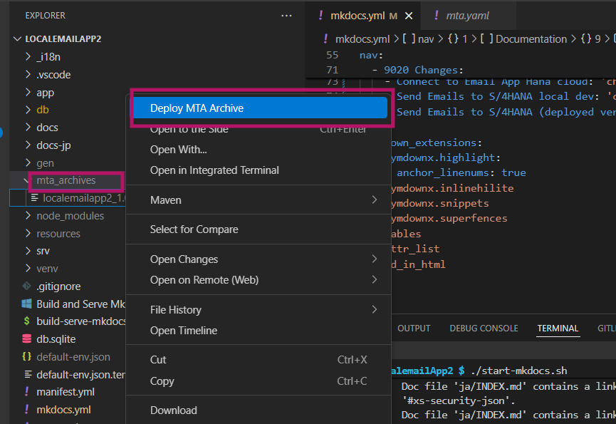
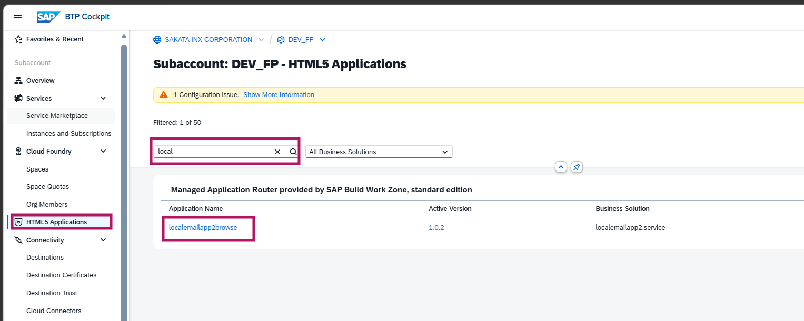
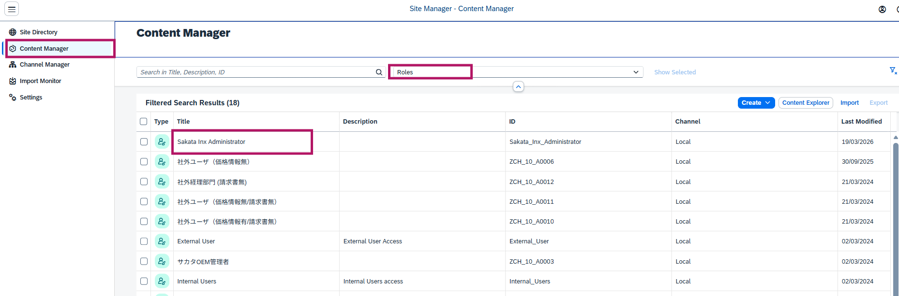
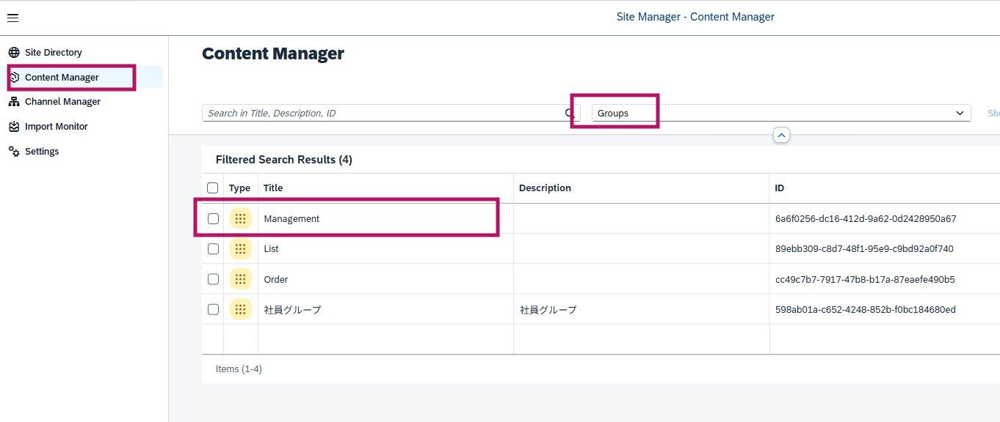
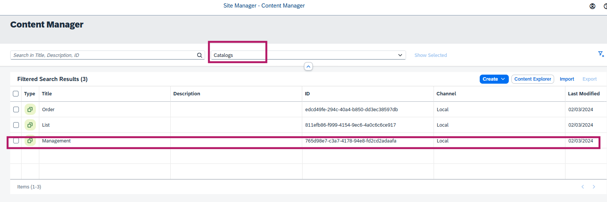
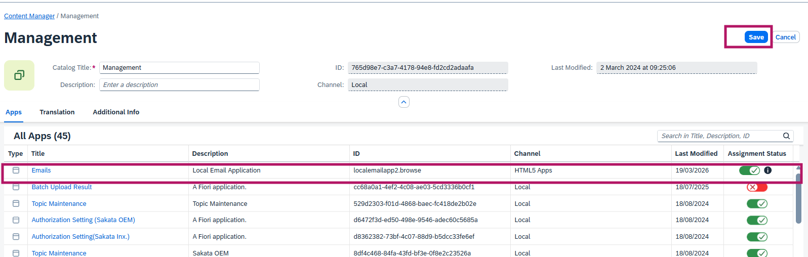

# Build Work Zoneへのアプリタイル追加方法（SAP BTP）

このガイドでは、SAP BTPのBuild Work Zoneにアプリタイルを追加する手順を説明します。

## ステップ1：BASからデプロイ

BAS（Business Application Studio）からアプリケーションをデプロイします。

## ステップ2：HTML5アプリでの確認

HTML5アプリリポジトリでアプリケーションがデプロイされていることを確認します。

## ステップ3：コンテンツマネージャー：ロールの修正

サイトのコンテンツを管理するために、コンテンツマネージャーに移動します。

## ステップ4：コンテンツマネージャー：グループの修正

## ステップ5：コンテンツマネージャー：カタログの修正

## まとめ

これらの手順を完了すると、アプリケーションタイルがBuild Work Zoneに表示されます。ユーザーはそれをクリックして、アプリケーションをランチパッドから直接起動できます。
