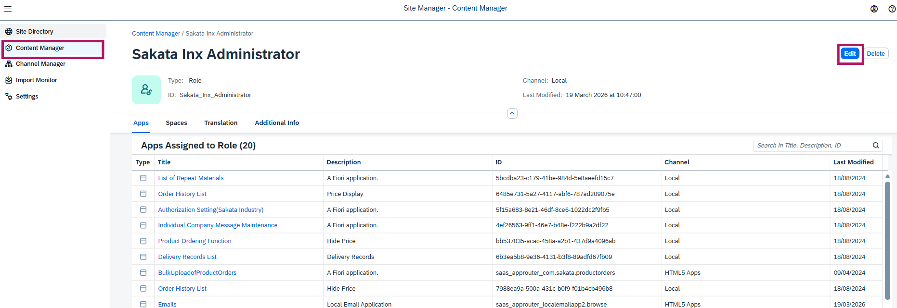
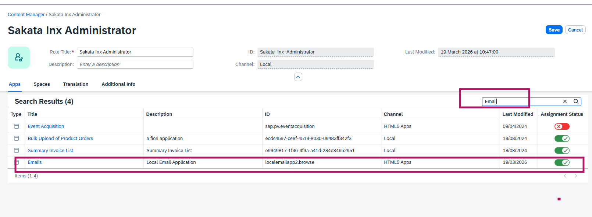
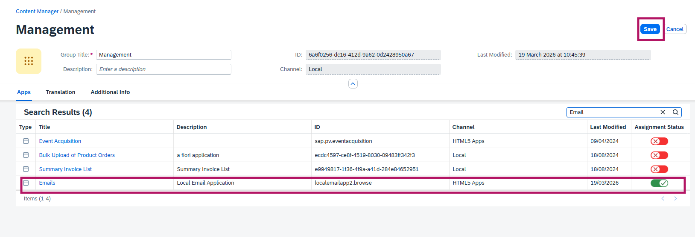

# How to Add an App Tile to Build Work Zone (SAP BTP)

This guide walks you through the process of adding an app tile to the Build Work Zone in SAP BTP.

## Step 1: Access the Site Directory

Deploy from BAS

## Step 2: Check in HTML5 Apps

Check app is deployed in HTML5 apps

## Step 3: Content Manager: Modify Roles

Go to the Content Manager section to manage your site's content.

## Step 4: Content Manager: Modify Groups

## Step 5:  Content Manager: Modify Catalogs

## Summary

After completing these steps, your application tile will be visible in the Build Work Zone. Users can click on it to launch your application directly from the launchpad.
